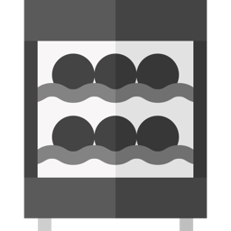

  

# Miele Wine (consumer cloud) — Home Assistant

Control and monitor a **Miele wine conditioning unit** (KWTUS / K7000 "EasyControl"
cooling appliances) from Home Assistant — including the **presentation light**, which
Miele's *3rd-party developer API* refuses to switch (`HTTP 400`) for cooling appliances
([astrandb/miele#730](https://github.com/astrandb/miele/issues/730)).

This integration talks to the **consumer app's cloud API** (`rest-*.domestic.miele-iot.com`)
using the same OAuth login the Miele phone app uses — so it can drive endpoints the
official/developer integrations can't.

## Entities

| Entity | What |
|---|---|
| `climate.*_zone_N` | Thermostat per zone: current + **set** target temperature (bounds from the appliance). Single fixed mode `cool` — the API exposes no way to switch the cabinet off |
| `light.*_presentation_light` | Presentation light on/off (`/Cooling/PresentationLight`) |
| `number.*_zone_N_light_intensity` | **Set** presentation-light intensity (0–7) |
| `number.*_humidity_level` | **Set** humidity control level (bounds from the appliance; the API exposes no %) |
| `switch.*` | Sabbath mode, child lock, active air filter (auto-created if the appliance reports them) |
| `sensor.*_zone_N_temperature` | Current temperature per cooling zone |
| `binary_sensor.*_zone_N_door` | Door open/closed per zone |
| `binary_sensor.*_zone_N_temperature_excursion` | **Problem** — zone outside the safe band for longer than the grace period |
| `binary_sensor.*_zone_N_door_left_open` | **Problem** — door open past the threshold |
| `sensor.*_zone_N_time_out_of_range_today` | Minutes outside the safe band today (resets at local midnight) |
| `sensor.*_zone_N_temperature_trend` | °C/h slope over the last hour — a failing compressor shows up here first (diagnostic) |

### Wine safety

The four safety entities are derived from the `Temp` and `Door` values already polled;
they add no API calls and write nothing to the appliance. Wine is damaged by *sustained*
deviation and by thermal cycling rather than by one momentary reading, so the excursion
alert integrates time out of band and only trips past a grace period, and the daily
counter adds up every minute out of range even when no single spell was long enough to
alarm.

Defaults: safe band **10–14 °C**, excursion grace **30 min**, door threshold **60 s**,
trend window **1 h**. These come from general wine-storage guidance, **not** from Miele
documentation — the appliance reports no such limits over this API. They are constants in
`const.py` today; if your cabinet is set outside 10–14 °C the excursion sensor will read
*problem* until the band is configurable. Resolution is the poll interval (60 s), so a
door opened and closed between two polls is invisible.

`number.*_zone_N_target_temperature` has been replaced by `climate.*_zone_N` — two
entities writing the same `/Cooling/{zone}/TargetTemp` node is a bug waiting to happen.
Automations calling `number.set_value` on it should call `climate.set_temperature`
instead; the stale entity is removed from the registry on upgrade.

## Requirements

- **Home Assistant 2024.4+** (the wine-cabinet icon needs **2026.3+**, via the
  in-integration `brand/` folder).
- A Miele account with the appliance already set up in the app, on the **owner** account.

## Install

### Via HACS (recommended)

Click the badge to add this repository to HACS on your instance:

…then **Download**, restart Home Assistant, and set up the integration (below). Or add
it manually: HACS → ⋮ → **Custom repositories** → paste this repo's URL, category
**Integration**.

### Set up the integration

1. Settings → Devices & Services → **Add Integration** → *Miele Wine*.
2. Enter your account **country code** (e.g. `be`, `de`, `nl`, `gb`).
3. The flow shows a Miele login URL. Open it in a browser, sign in **with the same
   account your phone app uses**, and when the browser refuses to open the final
   `miele://oauth2-code/?code=…` link (expected!), **copy that whole `miele://…` URL
   and paste it back** into the form.
4. Done — your wine cabinet and its entities appear.

> The appliance must already be set up in the Miele app on the **owner** account.

## How it works / limitations

- **Auth:** consumer MAP OAuth 2.0 + PKCE; the token (scope `mcs`) is refreshed
  automatically and persisted in the config entry (survives restarts).
- **Polling:** state is polled (~60 s). The appliance's realtime channel is a
  WebSocket (`mcs2`) — a future enhancement could push state instantly.
- Reverse-engineered against a **KWTUS 7096 E**. Other cooling appliances that expose
  `/Cooling/…` should work; entities self-adjust to what the appliance reports.

## Troubleshooting

- **"Reauthentication required"** — the stored token could no longer be refreshed
  (most often after you changed your Miele password). Just follow the reauth prompt
  and paste a fresh `miele://…` login, same as first setup.
- **Setup can't find the appliance** — make sure you signed in with the **owner**
  account (the one that set the cabinet up) and that it shows in the Miele app.
- **Entity briefly unavailable / a control "snaps back"** — Miele's cloud is a bit
  flaky (intermittent `HTTP 500`s, ~60s polling). Reads are retried; a rejected write
  (value out of range) surfaces as an error in the log.

## Credits

Icon: wine-cabinet icon from [Flaticon](https://www.flaticon.com/free-icon/wine-cooler_11623284).

## ⚠️ Caveats & disclaimer

Please read before installing:

- **Unofficial private API.** This talks to Miele's **consumer app** cloud
  (`rest-*.domestic.miele-iot.com`), *not* the documented 3rd-party developer API. It is
  undocumented and unsupported — Miele can change or break it at any time without notice.
- **It uses your account login.** Setup performs the consumer app's OAuth (PKCE) flow and
  stores the resulting token in Home Assistant. Treat HA state/history access as
  equivalent to access to your Miele account.
- **Possibly against Miele's terms.** Using the private app API may fall outside Miele's
  intended use / terms of service. Use it only on **your own account and appliance, at
  your own risk.**
- **Be gentle with the cloud.** The domestic endpoints rate-limit and are intermittently
  flaky (`HTTP 500`s). Don't lower the poll interval aggressively.
- **Reverse-engineered against one appliance** (KWTUS 7096 E). Other cooling models
  expose the same `/Cooling/…` shape, but behaviour may vary.
- **Not affiliated with or endorsed by Miele.** Provided as-is, without warranty. The
  wine-cabinet icon is not a Miele trademark.
